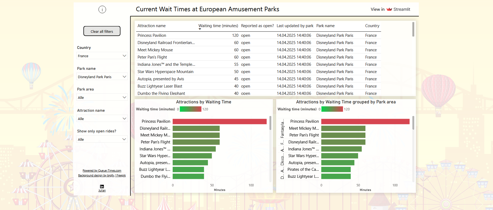

# Near real-time reporting Power-BI
A side project to get a get a near real-time report done with Power BI as frontend.

Refers to this project: https://github.com/JPFLUEGE/streamlit_amusement_park_api    

APIs being used: [Queue Times API](https://queue-times.com/pages/api)

I hosted this script on Azure Functions to execute it automatically in a specified time interval and wanted to share the code for easy replication.

As you can achieve near real-time reporting in Power BI with either a streaming dataset or a DirectQuery mode on a database, I decided to do both variations.

sendDatabase() inserts the data to the Postgresql database on Azure while sendPowerBI() sends it to the endpoint of the streaming dataset.

# Why?
I explored options on how to achieve a near real-time reporting with Power BI

# End product 

The report had to be set up twice but end result and design was the same.
When using a streaming dataset you have to allow cache (some historical values) in order to build a report which makes it necessary to create some measures to only show latest data retrieved (to avoid duplicate values shown or aggregation of those)

Example DAX:
Waiting time (min) = 
VAR _maxdate = MAX(RealTimeData[Last updated by park]) 

RETURN
CALCULATE(
    MAX(RealTimeData[Waiting time (minutes)]),
    RealTimeData[Last updated by park] = _maxdate
)

The .pbix file can be found in the "PowerBI file" folder of this repo.
It is the one using DirectQuery mode where no additional measures where needed.
Pleaes note that you cannot refresh it as you do not have access to the database.

# Contact
In case of questions reach out via LinkedIn as it is my preferred choice.